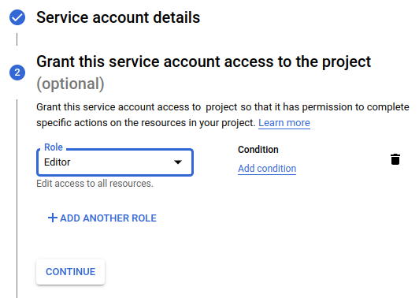

# Terraform GCP Storage Bucket

An Introduction to Cloud Infrastructure as Code: Provisioning a simple GCP Storage Bucket using Terraform.

## Features

<p align="center"><a href="https://cloud.google.com/"></a><a href="https://www.terraform.io/"></a></p>

 - This project is intended as the 'Hello, World!' of Infrastructure as Code. It provides a simple example of provisioning and managing a single cloud resource (in this case a storage bucket) in Google Cloud Platform (many other providers are supported) as a version controllable source file using Terraform.

 - GCP provides a suite of cloud computing services including computing, data storage, data analytics and machine learning.

 - Terraform codifies cloud APIs into declarative configuration files. This allows infrastructure configuration to be version controlled and deployments to be automated and repeatable.

 - Terraform allows environments to be created and destroyed by running a single Command Line Interface command. New environments can be struck up at the press of a button. Used in conjunction with Continuous Integration/Continuous Delivery Pipelines, ephemeral test environments can be created at software build time - existing only as long as needed to play their part in the software build process.

- This project provides a Terraform configuration [main.tf](main.tf) for creation of a storage bucket resource in GCP. By using the CLI a user can instruct Terraform to **apply** the resource to a GCP project. Terraform then uses GCP's GCloud API to provision the resource.

<p align="center"></p>

- Terraform maintains state information locally by default, so if any changes are made to the configuration (e.g. adding further storage buckets) it will know only to apply the additions rather than recreating all resources. Optionally, it is possible to store state information centrally in a *remote backend* (e.g. in cloud storage) which removes the dependency on a specific user's machine for provisioning.

- When the GCP resources are no longer required, Terraform's **destroy** phase ensures all resources are removed - avoiding unnecessary platform costs.

## Prerequisites

 - An installation of [Terraform CLI](https://learn.hashicorp.com/tutorials/terraform/install-cli)
 - A Google Cloud Platform account and installation of [Google Cloud SDK](https://cloud.google.com/sdk/docs/install)

## Getting Started

 - Log into Google Cloud Platform create a new project and *copy* the project ID.
 
 - Edit the [main.tf](main.tf) and *paste* your project ID into the **project** line:

```
  project     = "place-project-id-here"
```

 - Within your GCP account for the selected project, under *IAM & Admin* find the *Service Accounts* section and create a GCP service account.

<p align="center"></p>

 - Add the "Editor" priviledge to the service account user.
 
<p align="center"></p> 

 - Export the key as a json file and save in the root of this project.

<p align="center"></p>
 
 - Edit the [main.tf](main.tf) file and insert the file name of the exported json file into the **credentials** line, for example:

```
  credentials = file("my-project-key.json")
```

 - Lets take a quick look at the storage-bucket resource definition. The name is created using Terraform's *random_id* provider (resource names need to be unique). The GCP location used in this case is "US", the region "us-west1" is inherited from the provider. 

```
resource "google_storage_bucket" "storage-bucket" {
  force_destroy = true
  name     = "storage-bucket-${random_id.instance_id.hex}"
  location = "US"
}
```

 - At the command line, in the root of this project you will need to initialise Terraform:

```
terraform init
```

 - You can then validate that the syntax of the Terraform configuration is correct by running:

```
terraform validate
```

 - To see what changes Terraform will need to apply, run:

```
terraform plan
```
 - Now we are ready to deploy the infrastructure, you will need to confirm with 'yes' when prompted:

```
terraform apply
```
 - The storage bucket should now exist within your Google Cloud Platform account!

<p align="center"></p>

 - When you are finished and no longer want to incur charges for the storage bucket - destroy it as follows confirming with 'yes' when prompted:

```
terraform destroy
```

## Usage

```bash
terraform init
terraform validate
terraform plan
terraform apply
terraform destroy
```

## Contributing
If you have any feedback/ideas open an issue and tell me what you think.

## References/Related Projects
 - [https://terraform.io](https://terraform.io)
 - [https://cloud.google.com](https://cloud.google.com)